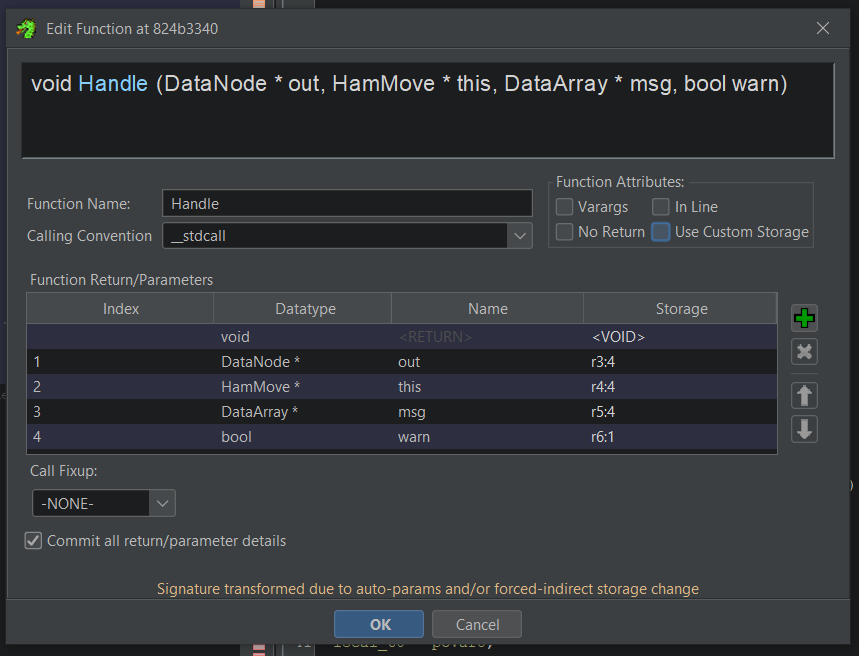

# So you want to help decompile Dance Central 3...
I don’t blame you, it's a phenomenal game - arguably one of HMX’s best works. There’s a clear demand to be able to play this game natively on PC, but with Xenia not providing Kinect support, and HMX currently in the Fortnite Festival mines, it’s highly unlikely that they’re going to provide these. So, we as a community have decided to undergo a decompilation, with the hopeful goal of porting what we’ve uncovered to PC ourselves. We can’t do it alone, though, and we welcome anybody who wants to contribute! Although decompilation is a fairly advanced process, we’re more than willing to help you get up to speed using this guide.

## Prerequisites
- C++ knowledge. You will **ESPECIALLY** need to know how virtual functions, inheritance, and polymorphism work, because HMX used all of these heavily in their codebase.
- A basic understanding of how PowerPC works, namely: data types and their byte sizes (i.e. an int is 4 bytes in memory), memory offsets, register usage for different functions/methods
- Access to the group Ghidra. If you don't currently have it, go to [ghidra.decomp.dev](ghidra.decomp.dev), and request read access to the RockBand repository.
- A local installation of [objdiff](https://github.com/encounter/objdiff).
- Your preferred text editor. We use [VSCode](https://code.visualstudio.com/) with the C++ and clang extensions, but anything should work as long as you have a good way of running `clang-format`.

## Helpful Resources
- [Resym](https://ergrelet.github.io/resym/) - you can use this to view PDBs of other Xbox 360 games. While this won't help you with DC3 specific classes, these will provide helpful info for XDK functions and structs.
- [The RB3 Decomp](https://github.com/DarkRTA/rb3) - RB3 and DC3 run under the same core engine - this means there is a TON of overlap between system-level classes. You can reference RB3's TUs against DC3's if they exist, and if you're lucky, the code you're working on may not have been changed at all, and you can integrate it into DC3 with minimal tweaks.
- [RB2 Wii Dwarf Dump](https://raw.githubusercontent.com/DarkRTA/rb3/refs/heads/master/doc/rb2_dump.cpp) - like a PDB, but for Wii - and it's for RB2. While RB2 Milo is definitely a ways away from DC3 Milo, you can still look at classes and their encapsulated members for reference.
- `docs/dc_symbols.txt` - contains demangled versions of all the MSVC symbols the map gave us. This will prove very helpful when resolving code merged entries, or filling out class headers.

## Workflow
### Initial Setup
- Initialize the decomp by following the build instructions on the main page of the repo. If the build went successfully, you should see the current progress percentage on your terminal.
  - **DISCLAIMER**: If you are not on Windows, you will have to build the repo under Wine. As of the time of me writing this guide, the preferred Wine alternative [Wibo](https://github.com/decompals/wibo) does not currently support the Xbox 360 compiler. There is ongoing work to add support for it, but it is not ready to use.
### Select and Initialize a TU (Translation Unit)
- Now, you decomp. You start this process by doing the following:
- Pick a TU you'd like to work on, and find that corresponding TU in `config/373307D9/objects.json`. If it's marked as `MISSING`, change it to `NonMatching` and re-run ninja. This will allow ninja to watch for that TU's .cpp file so it can be tracked in future builds.
- Add the TU's corresponding .h and .cpp files. This involves declaring function prototypes, static/global data, and any necessary classes/structs. Thankfully, this build of DC3 came with a map, so a LOT of the guesswork that comes with a traditional decomp project is gone here. Courtesy of the map, you are given symbols that provide the namespace/class, input parameters, return type, scope, AND encapsulation.
  - Code Symbols:
    - If you look at your chosen TU in objdiff, you will see the symbols used for it and can add them to your header accordingly.
    - Additionally, in the Symbol Tree window in Ghidra (if you don't see it, go to Window>Symbol Tree to show it), and follow the Classes folder until you find the class you want. All the symbols for that class can be found there as well.
  - Virtual Class Symbols:
    - If your class has a vtable (found in the Symbol Tree window or inside the class's constructor), your class has virtual methods. Navigate to the vtable and fill out your class header according to its entries. Note that pure calls will have a __purecall marker in the table - to find the functions these represent, you will have to find a derivative of the class you're looking at, and examine its vtable. Also, DC3 has code merging, so if you spot a code merged entry (Song::Copy is a notorious culprit of this), you will have to find the actual symbol for that class.
  - Data Symbols:
    - While we have symbols for static class members, standalone data structures used in a TU are not part of the map. Thus, you must either infer them by looking at their uses in other functions, or consult the RB3 decomp and see if the mystery structures are used there.
  - Class Members:
    - Try your best to deduce these - you can use the class's constructor as well as NewObject/operator new overloads for Hmx::Object derivatives to determine the class size.
    - Because the symbols provide encapsulation, you should try to encapsulate class members as well, to private or protected where possible.
### Decompile the Functions
- By this point, you should have a class header with (at least) the found methods filled out. It's okay if you don't entirely know for sure what the class members are at this point - those will hopefully become clearer as you decompile more and more of the class's functions. To decompile a function, I typically do the following:
  - Find the function in Ghidra and look at the decompiler window output. When you look at it, verify that the output matches the proper register placements. By that, I mean:
    - Functions typically use R3 as the first argument, R4 as the second argument, and so on and so forth, with their return value eventually going in R3.
    - For non-static class methods, R3 is implicitly `this` - meaning the first argument of the method would go in R4, the second in R5, etc.
    - This will be the case for most functions you encounter. However, some return larger struct types (most notably, Handles returning a DataNode, an 8 byte struct). When this happens, R3 = the return type, and the first argument goes in R4 instead. To get the decompiler output to play nice with this info in mind, change the function signature so that the return type is void, and the arguments go:
    
        (`return type*` out, `object*` this, `...`).

        So for example, `DataNode HamMove::Handle(DataArray* msg, bool warn)` would look something like this in Ghidra:
        

    - Make no mistake, the original function signature you got from the symbol is the correct way to write the function - this signature is just for Ghidra so the decompile output looks nicer.
  - With the Ghidra output now verified, this will serve as a solid skeleton/starting point. Use this to implement the function, and fine tune it to the best of your ability until it matches. You can verify this by going to the same function in your objdiff window, and comparing the resulting asm against the target asm.
- Rinse and repeat the above to your heart's desire, or until the TU is fully matched.
- Don't worry if you don't fully match everything, you'll pick up the skill as you work more and more, and any progress at all is good progress!

## Oddities to Watch Out for
- DC3 is both code merged and inlined. Some commonly inlined functions include `DataArray::Int/Float/Str`, `ObjectDir::Find<>`, and `std::vector` or `std::list` methods.
- Due to an intrinsic flag being enabled, `strcpy`, `strlen`, `strcmp`, and `strcat` are inlined. To detect usages of these, pay close attention to the decompiler output. For example, you could infer this:
  ```
  do {
    cVar1 = *pcVar2;
    pcVar2 = pcVar2 + 1;
  } while (cVar1 != '\0');
  ```
  to be `strlen`, as you can see a number being incremented in a loop - i.e. a string length.
- For the `system` folder, it can be worth not only consulting the RB3 decomp, but looking at RB3 retail, as there is MUCH less inlining, which can be helpful for determining extra function calls. You *could* also look at DC3 retail, but that is not recommended due to a lack of symbols and more importantly, the enabling of LTO.

## Formatting Guidelines

### Code formatting

Any code that is not from a third party library should be formatted with
`clang-format` before being submitted to the project. This avoids all questions
about code style and allows us to focus on what's actually important: decompiling the
game.

### Continuous Integration

We make use of GitHub Actions to ensure all code merged to the repository
produces a matching binary. If your code fails CI, you must fix it
before it can be merged.

### Naming conventions

We currently lack a formal set of naming conventions. The current advice is to
just try and follow what surrounding code does.

## Conclusion

That's the general gist! We’re happy you have an interest in contributing and can’t wait to see what you uncover! If you have any further questions, reach out to us on the [MiloHax discord](https://discord.gg/milohax) (for general milo engine knowledge/interest) or the [GC/Wii Decompilation Discord](https://discord.gg/hKx3FJJgrV) (although this is an Xbox 360 game, the GC/Wii also uses PowerPC, and this discord is very knowledgeable on decompiling with it).
